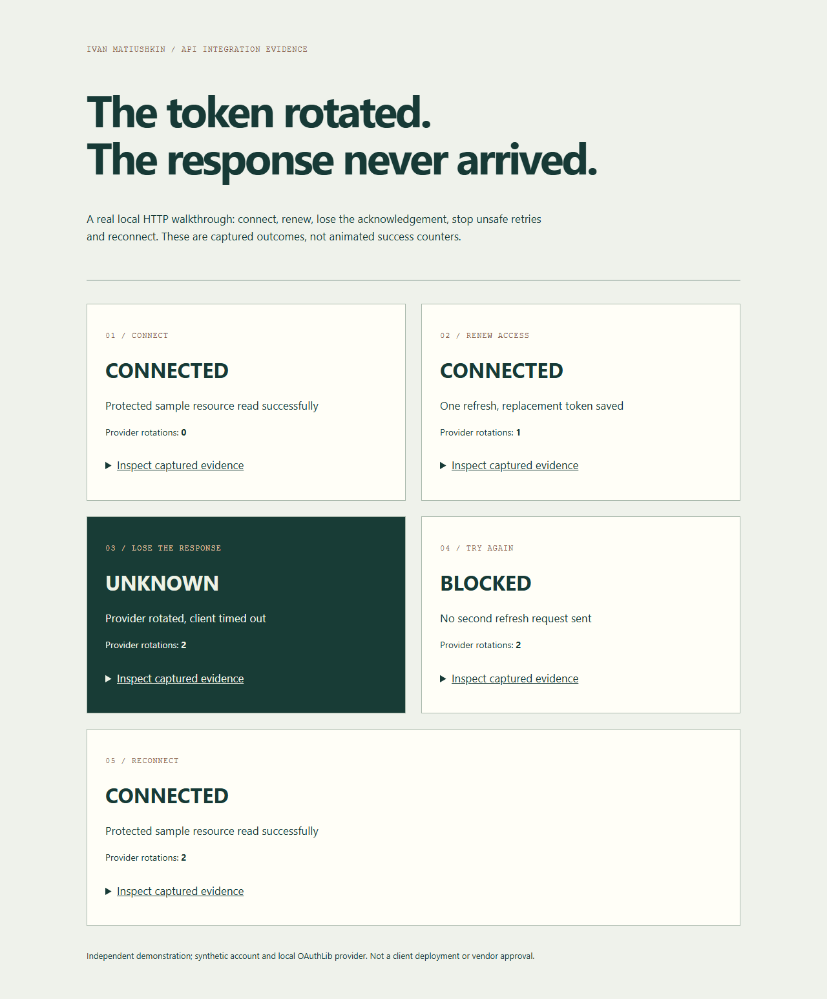

# OAuth Connection Recovery Lab

<!-- portfolio-navigation:start -->
[← Project index](https://github.com/Hadezu#selected-implementations) · [API integration](https://work.matiushkin.com/en/services/api-integration) · [Describe a similar task](https://work.matiushkin.com/en/contact?example=services%2Fapi-integration)

**Review format:** Local OAuthLib provider and captured recovery evidence. Not a certified vendor connector.

[Adjacent integration example: Data Bridge](https://work.matiushkin.com/en/data-bridge) demonstrates delivery and duplicate-write handling. OAuth authorization and token renewal are a separate failure boundary, demonstrated in this repository.
<!-- portfolio-navigation:end -->

[](https://github.com/Hadezu/oauth-connection-recovery/actions/workflows/verify.yml)

**The provider rotated the refresh token. Its response never reached your application. Is another retry safe?**

A Python integration proof with a real local **OAuthLib** authorization server, HTTP requests, PKCE, an encrypted SQLite token vault, durable refresh ownership and explicit reconnection after an ambiguous result.

Independent work by **Ivan Matiushkin with Codex**, using synthetic accounts. Not client history, an OAuth certification, a production identity service or an approved Meta/Google connector.



[Case study and buyer fit](docs/CASE-STUDY.md) · [Architecture](docs/ARCHITECTURE.md) · [Verification](docs/VERIFICATION.md) · [Commercial wording](docs/COMMERCIAL-USAGE.md) · [Captured HTML demonstration](evidence/report.html) · [Download the evidence package](https://github.com/Hadezu/oauth-connection-recovery/releases/tag/v0.1.0)

**Verified:** 33 local tests; GitHub CI on Python 3.12/3.14 plus Chromium report checks passed. [Exact evidence](docs/VERIFICATION.md).

## Run it in five minutes

Python **3.12–3.14**. No Docker, cloud account, credentials or paid infrastructure.

```sh
python -m venv .venv
# Linux/macOS: source .venv/bin/activate
# Windows PowerShell: .venv/Scripts/Activate.ps1
python -m pip install -r requirements.lock
python -m pip install --no-deps -e .
python -m pytest -q
python -m recovery.demo --out evidence
```

Open `evidence/report.html` locally. Expand each stage to inspect captured state transitions. The script starts a loopback provider on a free port, performs real requests, writes sanitized evidence and stops the server. Its temporary encryption key and databases are discarded. Existing evidence files are replaced when rerunning this example.

## What happens

| Scenario | Result |
|---|---|
| Authorization code + S256 PKCE | Read a protected synthetic resource |
| Wrong state, callback replay or wrong PKCE | Reject the attempt |
| Expired access token | Rotate and encrypt the replacement token |
| Eight callers renew together | One refresh owner; others fail busy or reuse the new access token |
| Provider rotates, HTTP response times out | UNKNOWN; no blind retry of the old grant |
| Invalid/revoked refresh grant | RECONNECT |
| Process exits after durable claim | Claim remains; recovery marks UNKNOWN without reissuing it |
| Reauthorization after UNKNOWN | New code and tokens; resource access restored |
| Stale completion after recovery | Version fence prevents overwriting newer local state |
| Inspect the database / report | Encrypted secrets in the vault; no tokens in the report |

The five-stage HTML report is a captured walkthrough, **not a live control panel**. Provider rotation counts come from the local provider, not a fabricated success metric. No analytics extraction, scheduled syncing or third-party account is claimed.

## Existing portfolio service

Supports [API integrations](https://work.matiushkin.com/en/services/api-integration) and complements [Data Bridge](https://work.matiushkin.com/en/data-bridge). The other webhook proof covers delivery and duplicate writes; this project addresses the separate failure boundary of **authorization and token renewal**.

## Attribution

Our contribution: `recovery/client.py` lifecycle/vault, provider adapter and fault injection, tests, report and documentation. **OAuthLib implements OAuth protocol validation**; cryptography implements Fernet; Flask/Werkzeug handle HTTP. These capabilities are not presented as our original cryptographic or protocol implementation. See [THIRD-PARTY.md](THIRD-PARTY.md). No upstream source is copied or modified.

## Boundary before any real deployment

The provider deliberately auto-approves a synthetic user and stores its fixtures in memory. Only loopback HTTP origins are accepted. Tenant arguments are supplied by trusted application code; this library is **not an authentication/authorization layer for callers**. Production needs HTTPS, actual user consent, authenticated tenant binding, managed keys/rotation, vendor-specific scopes and review, recovery UX and operational monitoring. Do not expose this lab to the Internet.

<details>
<summary>Technical verification recording</summary>

Original test recording retained as supporting evidence. For the scenario, results and limitations, see the verification documentation above.

[Download the original recording](docs/images/walkthrough.webm)

</details>
